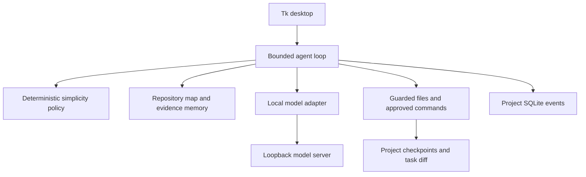

# Architecture

Existing single Python desktop process: Tk UI, one task worker and local SQLite. Preserve local_agent/; src/ is only the requested documentation-pack placeholder.

| Module | Responsibility |
|---|---|
| ui.py | Forms/dialogs, task thread/event queue, preferences/history/memory |
| agent.py, contracts.py | State progression, response schemas, revision verification, limits and repair |
| context.py | Ranked Python/JS/TS metadata and hash cache; files are still read to check hashes |
| simplicity.py | Inspection, dependency/abstraction/scope warnings and task-diff review; model-independent |
| models.py | Local Ollama and local OpenAI-compatible JSON responses |
| tools.py | Path guards, atomic writes, approval, command/output limits, snapshots/recovery |
| storage.py | SQLite tasks/events/cache/memory |
| resources.py | Hardware discovery, model selection and request targets |

Flow: request, inspection, plan, simplicity check, implementation, tests, diagnosis/repair/retest, diff review, result. Completion requires current-revision verification. Events feed UI/history. Changed source excludes stale verified-memory evidence.

Per-project data lives in .agent/; application preferences use the app-local .agent/. Scan limit is 2,000 files, map 100 ranked entries/12,000 characters with further prompt bounds. Source indexing is limited to 100 KB, editable files to 200 KB, and snapshots to 2 MB each. No distributed jobs, push notifications, accounts or public HTTP server exist.

Direct file tools reject linked/outside/protected paths; model endpoints are loopback-only with redirects/proxies disabled. Approved subprocesses have user OS rights, so approval is not isolation. Repository/model text remains untrusted. See [security](../SECURITY.md).

Deploy as source plus Python/Tk and separately installed runtime/models. One worker runs per instance; simultaneous project writers are not operationally supported. Hard caps, stronger isolation, plugin trust and scheduling remain future decisions. See [desktop ADR](DECISIONS/001-local-desktop.md) and [extension boundaries](EXTENSIONS.md).
