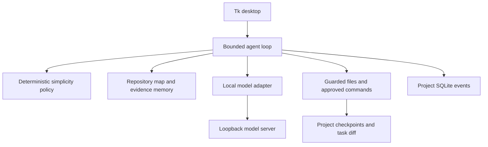

# Architecture

Existing single Python desktop process: Tk UI, one task worker, a startup discovery worker and local SQLite. Preserve local_agent/; src/ is only the requested documentation-pack placeholder.

| Module | Responsibility |
|---|---|
| ui.py | Forms/dialogs, discovery/task handoff through the event queue, preferences/history/memory |
| agent.py, contracts.py | State progression, response schemas, revision verification, limits and repair |
| context.py | Ranked Python/JS/TS metadata and hash cache; files are still read to check hashes |
| simplicity.py | Inspection, dependency/abstraction/scope warnings and task-diff review; model-independent |
| models.py | Local Ollama and local OpenAI-compatible JSON responses |
| tools.py | Path guards, atomic writes, approval, command/output limits, snapshots/recovery |
| storage.py | SQLite tasks/events/cache/memory |
| resources.py | Hardware discovery, model selection and request targets |

Flow: request, inspection, plan, simplicity check, implementation, tests, diagnosis/repair/retest, diff review, result. Completion requires current-revision verification. Events feed UI/history. Changed source excludes stale verified-memory evidence.

Per-project data lives in .agent/; application preferences use the app-local .agent/. Scan limit is 2,000 files, map 100 ranked entries/12,000 characters with further prompt bounds. Source indexing is limited to 100 KB, editable files to 200 KB, and snapshots to 2 MB each. No distributed jobs, push notifications, accounts or public HTTP server exist.

Direct file tools reject linked/outside/protected paths; model endpoints are loopback-only with redirects/proxies disabled. Approved subprocesses have user OS rights, so approval is not isolation. Repository/model text remains untrusted. See [security](../SECURITY.md).

Deploy as source plus Python/Tk and separately installed runtime/models. One worker runs per instance; simultaneous project writers are not operationally supported. Hard caps, stronger isolation, plugin trust and scheduling remain future decisions. See [desktop ADR](DECISIONS/001-local-desktop.md) and [extension boundaries](EXTENSIONS.md).

V1.2.0 startup handoff: the Tk thread captures plain values and constructs the local model adapter (no network request). A daemon worker checks hardware and installed models and queues a startup result. It never reads Tk variables or creates an Agent. The Tk poller discards a cancelled/closed result or creates the task worker. UI mutation/history/recovery actions are guarded during preparation. Startup cancellation is separate from Agent cancellation. This reuses existing standard-library threading/queue and introduces no persistent data format. Native database/preferences/setup operations remain synchronous; discovery is the bounded scope of this change.

## V1.3.0 repository indexing

Scanner and import ranking stay in tools.py/context.py; no new runtime module or dependency. Rules are inherited from each traversed directory's guarded `.gitignore`. Case-sensitive matches are processed in order; deeper rules follow parent rules. Directories excluded by a rule are pruned before traversal. Secret/metadata/reserved/link guards run first and cannot be reversed by `!`.

| Supported pattern | Meaning in this scanner |
|---|---|
| `/generated/` | Directory only, anchored at the containing ignore file's directory |
| `cache/` | Directory named cache at any traversed depth within that scope |
| `*.log`, `file?.txt`, `[ab].tmp` | Basename/component wildcards; `*` and `?` do not cross a slash |
| `pkg/*.log` | Path relative to the containing ignore scope; only that component depth |
| `assets/**/cache/` | Whole-component `**` can match zero or more directories |
| `build/**` then `!build/keep.py` | Exclude contents and restore that file while its parent remains traversable |
| Nested `.gitignore` | Rules apply only beneath its directory and override earlier matching rules |

Unsupported: backslash-escaped patterns, Git's global excludes and `.git/info/exclude`, Git configuration/case-folding behavior, ignore files over 200 KB. Unreadable/linked ignore files supply no rules. Leading spaces are literal; unescaped trailing whitespace is stripped. This is not a full gitignore implementation. Ignore exclusions control list/search/index/evidence scans; they do not make a direct-file permission boundary. The scanner retains its 2,000-returned-file cap with sorted traversal; the repository map remains at most 100 rows/12,000 serialized characters. This cap does not bound every directory visited.

Python AST metadata retains import levels and from-import targets. Candidate resolution considers existing `.py` modules and `__init__.py` packages using the current package for relative imports, and repository root then ordinary `src/` layout for absolute imports. Exact local paths receive a ranking boost; missing/external modules do not create synthetic rows or reads. Indexing never executes imports or project code. Dynamic imports, custom import hooks/sys.path, namespace/package export semantics and runtime symbol resolution remain unsupported. JS/TS extraction/ranking stays heuristic and unchanged. Related candidates only come from the files already admitted by the guarded scan.

The disposable index digest now uses SHA-256 over `index-v2` plus a NUL byte plus raw source bytes. Legacy content-only hashes mismatch once and are reparsed. Subsequent unchanged files reuse cached metadata. Ignored/deleted files are removed on index refresh. Evidence-memory fingerprints remain raw content hashes; if the scanned set changes, old verified memory may be excluded conservatively until new verification.

V1.4.0 adds an optional diagnostic script, scripts/measure_resources.py, reusing detect/preference_profile/pressure_adjust. It does not participate in the runtime loop or change production controls. Actual host snapshots and a fixed simulated policy sequence are reported separately.
