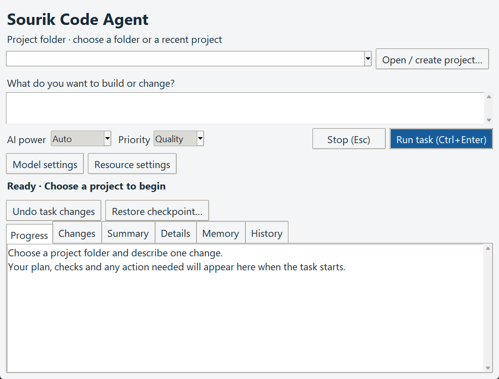
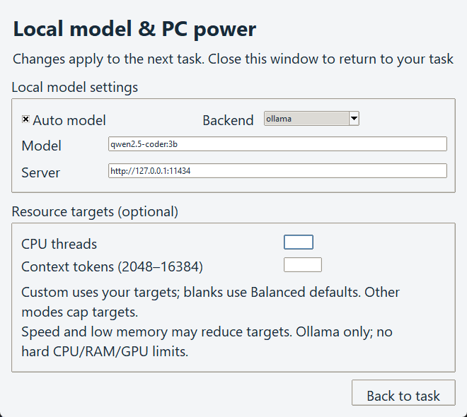

# V1.11.0 desktop design

Designed 2026-10-03 using the UI UX Designer workflow after the separate [technical audit](UI_AUDIT.md).

## Product and direction

Sourik Code Agent is a Windows Python/Tk workspace for its owner and non-programmers completing verified coding tasks locally. This design keeps the existing toolkit, model controls, checkpoints and permission prompts. It uses a quiet light workspace with a blue Run action, clear field labels and a readable results area. There is no web UI, external font, paid design dependency or new design framework.

## Task and settings flow

Choose a project/recent folder -> describe one change -> choose AI power and Quality/Speed priority -> Run -> review command permissions -> inspect progress, checks, changes and the summary -> use existing recovery when needed.

Model settings and Resource settings open the same nonmodal Settings window. Custom opens it and focuses CPU threads. All fields reuse the existing Tk variables and saved preferences. Closing Settings, Back to task or Escape withdraws that window; Escape there does not stop the task. The main window remains usable. Changes during discovery/work continue to apply to the next task.

Separate settings were selected over an inline expansion because the measured 780x600 workspace lost essential controls when settings expanded. A separate toolkit window fixes that constraint without introducing a scrolling framework or rearranging agent state.

## Screen design

- Workspace: compact product heading, explicit project label/recents, request, labeled AI power/priority, prominent Run and secondary Stop. Settings navigation and wrapped task status follow. Recovery stays visible before the expanding results notebook.
- Results: Progress, Changes, Summary, Details, Memory and History. Summary/Details/Memory/History are display labels; existing internal view names, event routing and persistence remain intact. Guidance appears in empty Progress/Summary panes. Code/diff output uses Consolas; ordinary progress/results use Segoe UI.
- Settings: labeled Auto model/backend, model and server fields, CPU/context targets and existing scope/backoff explanation. Model/server entries expand across available width. Back to task closes the surface without resetting values.

## Style and states

| Role | Value |
|---|---|
| Workspace | #f3f5f7 |
| Content/text fields | #ffffff |
| Text | #172b3a |
| Run | #175d9c with #ffffff text |
| Run hover | #124d82 |
| Disabled Run | #dbe2e8 with #526372 text |
| Body | Segoe UI 10 pt; request 11 pt |
| Heading | Segoe UI 16 pt bold; Settings 15 pt bold |
| Layout | 12 px workspace inset; 16 px Settings inset; 4-12 px group gaps |

Tk focus indicators, keyboard traversal and widget disabled states remain. No animation or color-only state carries meaning. Preparing, failed startup, cancellation, completion and actual errors retain the existing status/event/dialog behavior. No new permission is granted by appearance or navigation.

## Verification and limits

The two new native regressions reproduced missing recovery/output space and Settings clipping before their repairs. All 28 focused UI/resource tests and 120 full tests passed (118 passed, two Windows symlink skips). Tests cover the 780x600 workspace at Tk scaling 2.0, visible recovery actions, at least 70 px of output, Settings vertical fit, Custom focus, Settings Escape, startup snapshots and existing shortcuts.

Before/after captures are local under .runtime/ui-captures. Initial geometry collection walked the Settings Toplevel as though it were inside the main window; floating child bounds are a separate surface and are not a main-layout defect. Main recovery/output and each Settings control were independently verified by native tests. Full manual Narrator, Windows high contrast, multi-monitor DPI and keyboard permission/recovery journeys remain untested. No accessibility certification is implied.

## Built previews

