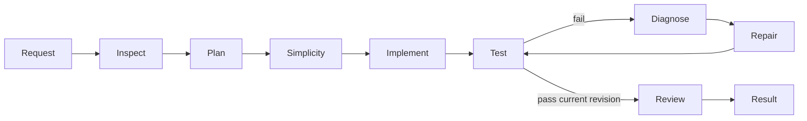

# User flows

No sign-in exists. OS access to the desktop/project is the current access boundary. Stored notes never grant permission.

## F01 - Launch and select (R01,R05,R07,R08)

Preconditions: Python/Tk, running local server and installed model. Launch, choose project, inspect Auto/Quality or local settings, enter goal. Empty recent history is normal. Missing model/runtime, invalid endpoint and inaccessible folder must show errors. Discovery can block startup. Success: selected project ready for work; automatic download is not promised.

## F02 - Complete task (R01,R02,R03,R06,R07)

From an idle selected project enter a nonempty goal and Run. The agent inspects files/memory, plans, checks simplicity and invokes tools. Read exact command arguments/directory and approve or deny. Denial cannot count as verification. Failed tests lead to diagnosis, smallest correct repair and retest. Review Changes and What changed? An already-satisfied task can verify with zero code changes.

Stop requests cancellation; a pending model call can take 120 seconds. Invalid responses, limits or persistent failure end as errors, not fabricated success. Empty projects are supported; zero discovered tests do not verify. Approved commands have user OS rights.

## F03 - Memory/history (R04)

Open memory, inspect a note/verified result, add a nonblank note or forget an entry. Empty lists are valid. Changed evidence excludes verified reuse; notes can be stale. Select a history goal and Run to start a fresh task/checkpoint, not resume paused execution. Surface database errors. Current files and permissions override memory.

## F04 - Recovery (R03)

After unwanted/interrupted work, inspect checkpoint/diff and request rollback. Compare fingerprints; separately confirm overwriting later conflicting edits. Cancel and back up if unsure. Missing/legacy evidence is not proof of safe overwrite. Recovery covers captured project files, not arbitrary external command effects.

## F05 - Settings (R05,R08)

Choose power and Quality/Speed; optionally set CPU/context, backend, endpoint and model. Reject invalid numeric targets. If no suitable installed model exists, install separately or select a compatible existing one. Low RAM reduces future targets, not necessarily loaded weights. Success: valid settings applied to later work; exact resource percentages are not guaranteed. Compare versions sequentially on separate project copies.
